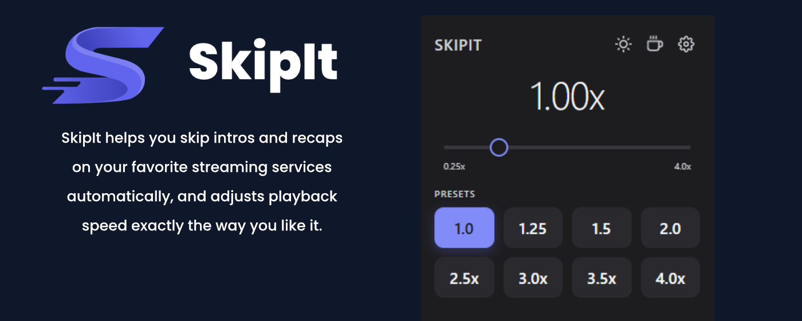

# SkipIt - Chrome Extension Documentation




> **SkipIt** is a Chrome Extension that optimizes your video playback by automatically skipping intros, recaps, and credits while providing full control over playback speed.

---

## 📋 Table of Contents

- [Features](#-features)
- [Supported Platforms](#-supported-platforms)
- [Installation](#-installation)
- [Usage](#-usage)
- [Settings](#-settings)
- [Keyboard Shortcuts](#-keyboard-shortcuts)
- [Technical Details](#-technical-details)
- [Frequently Asked Questions (FAQ)](#-frequently-asked-questions-faq)
- [Privacy](#-privacy)
- [Support](#-support)
- [Contributing](#-contributing)

---

## ✨ Features

### 🎬 Automatic Skipping

- **Skip Intros**: Automatically skips TV series intros on streaming platforms
- **Skip Recaps**: Jumps over previous episode summaries
- **Skip Credits**: Optionally skip credits at the end of episodes
- **Smart Detection**: Recognizes skip buttons on various platforms and clicks them automatically

### ⚡ Speed Control

- **Full Control**: Adjust playback speed from 0.25x to 4.0x
- **Presets**: 8 customizable speed presets for quick access
- **Real-time Adjustment**: Change speed during playback with the slider
- **Per-Site Settings**: Saves your preferred speed for each website

### ⌨️ Keyboard Shortcuts

- **+**: Increase speed (+0.25x)
- **-**: Decrease speed (-0.25x)
- **1-8**: Quick access to presets 1-8

### 📊 Statistics

- Tracks skipped intros and recaps
- Calculates time saved
- Displays your usage statistics in settings

### 🎨 Customization

- **Dark Mode**: Full support for light and dark themes
- **OSD (On-Screen Display)**: Shows speed changes directly in the video
- **Notifications**: Optional notifications when skipping content

---

## 🌐 Supported Platforms

SkipIt works on all major streaming platforms:

### Auto-Skip Features Available On:

- **Netflix** - Intros, Recaps & Credits
- **Disney+** - Intros, Recaps & Credits
- **Amazon Prime Video** - Intros, Recaps & Credits
- **Crunchyroll** - Intros & Recaps
- **Apple TV+** - Intros & Recaps
- **Paramount+** - Intros & Recaps

### Speed Control Works On:

- **All platforms listed above**
- **YouTube** - Full support
- **Vimeo** - Full support
- **Any website with HTML5 video player**

---

## 📥 Installation

### From Chrome Web Store (Recommended)

1. Visit the extension in the Chrome Web Store
2. Click "Add to Chrome"
3. Confirm the installation
4. The SkipIt icon will appear in your Chrome toolbar

### Manual Installation (Developer Mode)

1. Download the source code or clone the repository

```bash
git clone https://github.com/jonawy/Skipit_Chrome_Extension.git
```

2. Open Chrome and navigate to `chrome://extensions/`
3. Enable "Developer mode" in the top right
4. Click "Load unpacked"
5. Select the folder with the extension files
6. SkipIt is now installed!

---

## 🚀 Usage

### Getting Started

After installation, you'll be guided through a brief onboarding that explains the main features.

### Popup Interface

Click the SkipIt icon in the Chrome toolbar to open the popup:

1. **Speed Display**: Shows the current playback speed
2. **Slider**: Drag the slider to adjust speed
3. **Presets**: Click a preset for instant access
4. **Skip Toggles**:
   - **Skip Intro**: On/Off for automatic intro skipping
   - **Skip Recap**: On/Off for automatic recap skipping
5. **Buttons**:
   - **Moon/Sun**: Toggle dark mode
   - **Coffee Cup**: Support the project
   - **Gear**: Open settings

### On a Streaming Service

1. Open Netflix, Disney+, or another supported service
2. Start a video
3. The extension works automatically:
   - Skip buttons are automatically detected and clicked (if enabled)
   - Your saved speed setting is applied
4. Use keyboard shortcuts for quick adjustments

---

## ⚙️ Settings

Open the settings page by clicking the gear icon in the popup.

### Statistics

- **Time Saved**: Total time saved through auto-skip
- **Intros Skipped**: Number of intros skipped
- **Recaps Skipped**: Number of recaps skipped
- **Reset**: Reset statistics

### Presets

Customize the 8 speed presets:

- Click a preset to edit
- Enter a custom name (e.g., "Fast", "Double")
- Set the desired speed (0.25x - 4.0x)
- The first 4 presets are freely customizable
- Presets 5-8 use default values (2.5x, 3.0x, 3.5x, 4.0x)

### Streaming Services

Enable or disable SkipIt for specific services:

- **Netflix** ✓
- **Disney+** ✓
- **Amazon Prime** ✓
- **YouTube** ✓
- **Crunchyroll** ✓
- **Apple TV+** ✓
- **Paramount+** ✓

### Advanced Settings

#### Keyboard Shortcuts

- **+**: Increase speed (+0.25x)
- **-**: Decrease speed (-0.25x)
- **1-8**: Select preset

#### Auto-Skip Settings

- **Click Delay (ms)**: Wait time before clicking skip buttons (Default: 500ms)
  - Increase this value if skips trigger too early
  - Decrease it for faster reactions
- **Debug Mode**: Enables verbose console output for troubleshooting

---

## ⌨️ Keyboard Shortcuts

### Speed Control

- **+** or **NumPad +**: Increase speed by 0.25x
- **-** or **NumPad -**: Decrease speed by 0.25x

### Presets

- **1**: Preset 1 (Default: 1.0x - Normal)
- **2**: Preset 2 (Default: 1.5x)
- **3**: Preset 3 (Default: 2.0x)
- **4**: Preset 4 (Default: 2.5x)
- **5**: Preset 5 (Default: 2.5x)
- **6**: Preset 6 (Default: 3.0x)
- **7**: Preset 7 (Default: 3.5x)
- **8**: Preset 8 (Default: 4.0x)

**Note**: Keyboard shortcuts only work when focus is on the video, not in input fields.

---

## 🔧 Technical Details

### Architecture

```
SkipIt Extension
├── manifest.json          # Extension configuration (Manifest V3)
├── background.js          # Service worker for background tasks
├── content.js             # Content script for video manipulation
├── popup.html/js/css      # Popup user interface
├── options.html/js/css    # Settings page
└── support-prompts.js     # Support prompts
```

### Technologies

- **Manifest Version**: 3 (latest Chrome Extension API)
- **Permissions**:
  - `storage` - Store settings and statistics
  - `<all_urls>` - Work on all websites (for content scripts)
- **Storage**: Chrome Sync Storage for cross-device synchronization
- **Performance**:
  - Caching for frequently used data
  - Debouncing for storage writes
  - WeakSet for efficient memory management

### How It Works

#### Speed Control

1. Content script detects `<video>` elements on the page
2. MutationObserver monitors for new video elements
3. Sets `video.playbackRate` for speed changes
4. Automatically saves settings per website
5. Synchronizes with popup in real-time

#### Auto-Skip

1. **Platform Detection**: Recognizes the streaming platform by URL
2. **Button Search**:
   - Uses platform-specific CSS selectors
   - Polling interval: 500ms (adjustable)
   - MutationObserver for dynamically added buttons
3. **Visibility Check**: Verifies buttons are visible and clickable
4. **Click Simulation**:
   - Simulates real mouse events (PointerEvent, MouseEvent)
   - Works with React/Vue-based players (Disney+)
   - Debouncing prevents multiple clicks (2 seconds)
5. **Statistics Tracking**: Counts skipped intros/recaps and time saved

#### Button Selectors

The extension uses a comprehensive list of selectors for each platform:

**Netflix**:

```javascript
'[data-uia="player-skip-intro"]';
'[data-uia="player-skip-recap"]';
'[data-uia="player-skip-credits"]';
```

**Disney+**:

```javascript
'[data-testid="skip-intro-button"]';
'[aria-label*="Skip Intro"]';
'[aria-label*="Intro überspringen"]';
```

**Amazon Prime**:

```javascript
".atvwebplayersdk-skipelement-button";
'[aria-label*="Skip Intro"]';
```

See `content.js` for the complete list of all selectors.

---

## ❓ Frequently Asked Questions (FAQ)

### General

**Q: Is SkipIt really free?**  
A: Yes! SkipIt is 100% free with no restrictions. All features are available to all users.

**Q: Does SkipIt work on all websites?**  
A: Speed control works on any website with HTML5 video. Auto-skip only works on supported streaming platforms (Netflix, Disney+, Amazon Prime, Crunchyroll, Apple TV+, Paramount+).

**Q: Are my settings synced across devices?**  
A: Yes, if you're signed into Chrome, your settings are automatically synchronized via Chrome Sync.

### Troubleshooting

**Q: Auto-skip doesn't work on [Platform]**  
A: Try the following:

1. Check if auto-skip is enabled in settings
2. Make sure the platform is enabled in settings
3. Enable debug mode in advanced settings
4. Open the browser console (F12) and look for `[SkipIt]` messages
5. The platform may have changed their HTML - report the issue

**Q: Speed control doesn't work**  
A: Some websites override the speed. Try:

1. Reload the page
2. Pause and resume the video
3. Close another browser tab that might be affecting the speed

**Q: Keyboard shortcuts don't work**  
A: Make sure that:

1. Focus is on the page (not in an input field)
2. You're not holding modifier keys (Ctrl, Alt, Cmd)
3. A video is present on the page

### Privacy & Security

**Q: What data does SkipIt collect?**  
A: SkipIt collects no personal data. All statistics and settings are stored locally in your browser. There is no tracking software, no analytics, and no data transmission to external servers.

**Q: Why does SkipIt need access to all websites?**  
A: The `<all_urls>` permission is required for speed control to work on any website with videos. The extension only accesses video elements and doesn't manipulate other page data.

**Q: Is SkipIt open source?**  
A: Yes, the source code is available on GitHub. You can view, review, and contribute to the code.

---

## 🔒 Privacy

SkipIt respects your privacy:

### What We DON'T Do:

- ❌ No data collection
- ❌ No tracking
- ❌ No analytics
- ❌ No external communication
- ❌ No sharing of data with third parties

### What We DO:

- ✅ Local storage of all settings in your browser
- ✅ Chrome Sync for cross-device settings (optional, managed by Google)
- ✅ Complete transparency through open source
- ✅ No permissions except those required for functionality

**Full Privacy Policy**: [Privacy Policy](https://jonawy.github.io/Skipit_Chrome_Extension/privacy-policy.html)

---

## 💬 Support

### Support Options

If you need help or want to support the project:

1. **☕ Buy me a Coffee**: [buymeacoffee.com/jonawy](https://buymeacoffee.com/jonawy)  
   One-time contribution to fund development

2. **⭐ Rate on Web Store**  
   Help others discover SkipIt by leaving a review

3. **💬 Share with Friends**  
   Recommend SkipIt if you like it

4. **🐛 Send Feedback**  
   Report bugs or suggest new features

### Contact

- **GitHub Issues**: [github.com/jonawy/Skipit_Chrome_Extension/issues](https://github.com/jonawy/Skipit_Chrome_Extension/issues)
- **Website**: [jonawy.github.io/Skipit_Chrome_Extension](https://jonawy.github.io/Skipit_Chrome_Extension/)

---

## 🤝 Contributing

Contributions are welcome! Here's how you can help:

### Bug Reports

1. Open an issue on GitHub
2. Describe the problem in detail
3. Add steps to reproduce
4. Include screenshots (if relevant)
5. Add browser console logs (enable debug mode)

### Feature Requests

1. Open an issue on GitHub
2. Describe the desired feature
3. Explain the use case
4. Discuss with the community

### Code Contributions

1. Fork the repository
2. Create a feature branch (`git checkout -b feature/AmazingFeature`)
3. Commit your changes (`git commit -m 'Add some AmazingFeature'`)
4. Push to the branch (`git push origin feature/AmazingFeature`)
5. Open a Pull Request

### Development Guidelines

- Follow the existing code structure
- Comment complex logic
- Test on all supported platforms
- Update documentation

---

## 📜 License

SkipIt is free software. You can freely use, modify, and distribute the extension.

---

## 🙏 Acknowledgments

Thank you to everyone who uses and supports SkipIt!

Special thanks to:

- The open-source community
- All beta testers
- Everyone who submits feedback and suggestions
- Everyone who supports the project financially

---

## 📚 Additional Resources

### Links

- **Landing Page**: [https://jonawy.github.io/Skipit_Chrome_Extension/](https://jonawy.github.io/Skipit_Chrome_Extension/)
- **Privacy Policy**: [https://jonawy.github.io/Skipit_Chrome_Extension/privacy-policy.html](https://jonawy.github.io/Skipit_Chrome_Extension/privacy-policy.html)
- **GitHub Repository**: [https://github.com/jonawy/Skipit_Chrome_Extension](https://github.com/jonawy/Skipit_Chrome_Extension)
- **Support**: [https://buymeacoffee.com/jonawy](https://buymeacoffee.com/jonawy)

### Changelog

#### Version 1.0.0 (Current)

- ✨ First public release
- 🎬 Auto-skip for 6 streaming platforms
- ⚡ Full speed control (0.25x - 4.0x)
- ⌨️ Keyboard shortcuts
- 📊 Statistics tracking
- 🎨 Dark mode
- 🌐 Multi-language button detection

---

<div align="center">

**Enjoy your videos with SkipIt! 🎬⚡**

[Website](https://jonawy.github.io/Skipit_Chrome_Extension/) •
[Support](https://buymeacoffee.com/jonawy) •
[GitHub](https://github.com/jonawy/Skipit_Chrome_Extension)

</div>
